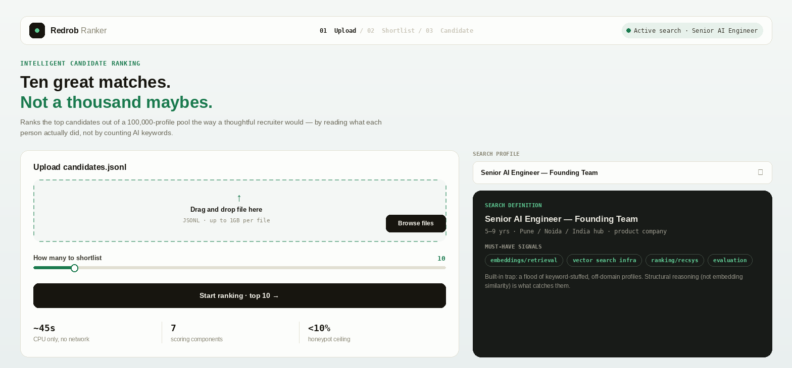
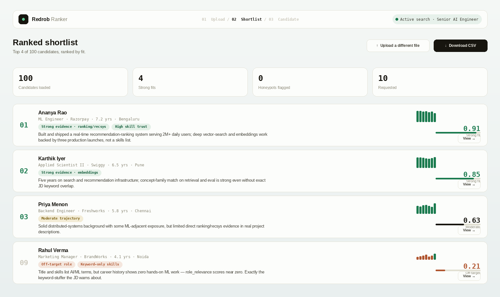
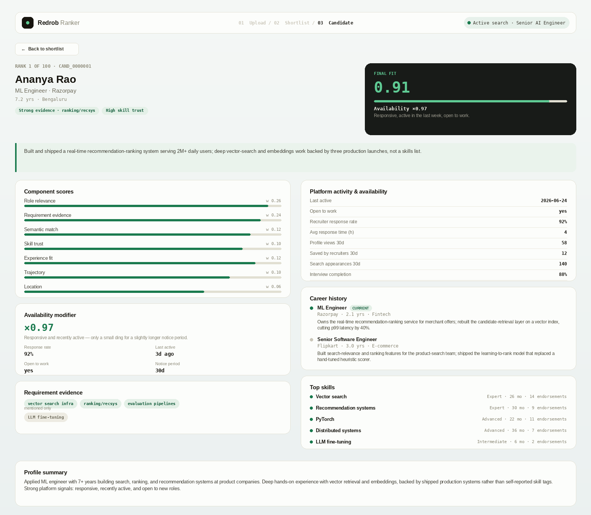

# Redrob Ranker — Intelligent Candidate Discovery & Ranking

Ranks the **top 100 candidates** out of a 100,000-profile pool for the released
**Senior AI Engineer — Founding Team** job description — the way a thoughtful
recruiter would: by reading what each person *actually did*, not by counting AI
keywords.

- **CPU only. No network at ranking time. ~45 seconds** on the full pool.
- Produces `submission.csv` (top 100 + per-candidate reasoning) that passes the
  official `validate_submission.py`.
- Verified clean: **0 keyword-stuffers and 0 honeypots** in the top 100.

---

## 1. Screenshots

The hosted sandbox (`app.py`) walks a recruiter through three screens. *(Recreated at
pixel-fidelity from the app's actual CSS/colors for this README — open the
[live sandbox](#9-sandbox-required-for-submission) to see it for real.)*
https://the-data-ai-challenge-sxmxdrybsfs6drfuxwpqut.streamlit.app/

**01 · Upload** — drop in a `.jsonl` file, pick a search profile, choose how many to shortlist.



**02 · Ranked shortlist** — every candidate scored and explained, strongest first.



**03 · Candidate detail** — the full evidence trail behind one score: component breakdown,
availability modifier, requirement evidence, career history, and platform signals.



---

## 2. TL;DR — run it in three commands

```bash
# 0) you need Python 3.9+ and the dataset file candidates.jsonl in this folder
python test_rank.py                                                   # ~5s sanity check
python rank.py --candidates ./candidates.jsonl --out ./submission.csv # ~45s, writes the CSV
python validate_submission.py ./submission.csv                        # prints "Submission is valid."
```

Or do all three at once:

```bash
chmod +x reproduce.sh
./reproduce.sh ./candidates.jsonl ./submission.csv
```

That's it. No pip install, no API key, no GPU, no internet needed.

---

## 3. Prerequisites

| Requirement | Detail |
|---|---|
| **Python** | 3.9 or newer. Check with `python --version` (or `python3 --version`). |
| **Dependencies** | **None** for ranking — `rank.py` uses only the Python standard library. |
| **The dataset** | `candidates.jsonl` (100k lines, ~465 MB). Get it from the hackathon bundle — see step 4. |
| **OS** | Any (Linux, macOS, Windows). |

> On some systems the command is `python3` instead of `python`. Use whichever
> prints a 3.9+ version.

Optional extras (only if you want the sandbox demo or to regenerate the rubric):

```bash
pip install -r requirements-dev.txt   # installs streamlit for app.py
```

---

## 4. Get the dataset

The repo does **not** ship `candidates.jsonl` (it's huge). From the hackathon
bundle:

```bash
# if you have the gzipped version:
gunzip -k candidates.jsonl.gz        # -k keeps the .gz, you get both
wc -l candidates.jsonl               # should print 100000
```

Place `candidates.jsonl` in the repo root (next to `rank.py`). `rank.py` also
accepts a gzipped file directly:

```bash
python rank.py --candidates ./candidates.jsonl.gz --out ./submission.csv
```

A tiny `sample_candidates.json` (50 profiles) ships in the repo so the tests and
the sandbox demo work without the full file.

---

## 5. How to run — step by step

### Step 1 — sanity test (no dataset needed)
```bash
python test_rank.py
```
Runs in seconds on `sample_candidates.json`. Confirms the pipeline works and the
output obeys the submission contract (unique ranks, well-formed ids,
non-increasing scores with id-ascending tie-breaks, differentiated scores,
non-empty unique reasoning, and identical output across repeated runs). Prints
`All tests passed.`

### Step 2 — produce the ranking
```bash
python rank.py --candidates ./candidates.jsonl --out ./submission.csv --progress
```
`--progress` (optional) prints a line every 10k candidates so you can watch it.
Finishes in ~45s and writes `submission.csv` with columns
`candidate_id,rank,score,reasoning`.

### Step 3 — validate the format
```bash
python validate_submission.py ./submission.csv
```
Prints `Submission is valid.` if everything is correct. This is the same
validator the organizers run, so a pass here means the format won't be
auto-rejected.

### Tuning (optional)
Everything that controls behavior lives in **`artifacts/jd_rubric.json`** —
component weights, the concept term lists, disqualifier markers, and behavioral
weights. Edit that file and re-run `rank.py`. No code changes needed.

---

## 6. What every file is

```
rank.py                  THE judged step. Streams candidates.jsonl, scores each
                         profile, writes the top-100 CSV. Stdlib only, no network.
ranker/
  honeypot.py            Detects internally-impossible profiles (honeypots) via
                         consistency checks, so they can't reach the top ranks.
  scoring.py             The seven scoring components + ideal-profile bonus +
                         the behavioral availability modifier.
  reasoning.py           Builds the honest, candidate-specific reasoning strings
                         (deterministic, from real facts — cannot hallucinate).
artifacts/
  jd_rubric.json         The structured rubric derived from the JD. rank.py reads
                         this. Committed, so no network is ever required.

test_rank.py             No-network test suite (run before you trust a change).
reproduce.sh             One command: test -> rank -> validate.
validate_submission.py   Official format validator (from the bundle).

build_rubric.py          OPTIONAL. Offline helper that uses an LLM (via OpenRouter)
                         to regenerate jd_rubric.json from the JD. Not used at
                         ranking time. Safe to ignore or delete.

app.py                   Streamlit sandbox demo (the required hosted sandbox).
screenshots/             README screenshots of the three app.py screens.
sample_candidates.json   50-profile sample used by tests + the demo.
job_description.txt       The released JD.
candidate_schema.json    The candidate data schema (reference).

submission.csv           The current ranked output (top 100).
submission_metadata.yaml Portal metadata — FILL IN the TODO fields before submitting.
approach_deck.pdf        The approach deck (submit this).
approach_deck.pptx       Editable source of the deck.
deck/build_deck.js       Script that generates the deck.

requirements.txt         Empty on purpose — rank.py needs nothing.
requirements-dev.txt     streamlit, only for the sandbox demo.
```

---

## 7. How it works (the approach)

The JD says the quiet part out loud: *"the right answer is not find candidates
whose skills section contains the most AI keywords — that's a trap we've
explicitly built in."* So the system is built on **structural reasoning**, not
embedding similarity (similarity is exactly what keyword-stuffers fool).

**Seven transparent components**, each producing a 0–1 score plus the evidence
used to explain it:

| Component | Weight | What it captures |
|---|---|---|
| **role_relevance** | 0.26 | current title vs an off-domain list — the decisive anti-stuffer signal (a "Marketing Manager" with every AI keyword scores ~0.08) |
| **core_requirements** | 0.24 | embeddings / vector-search / ranking / eval evidence, weighted by **where** it appears (proof in real career-history descriptions counts ~3× a bare skills-list keyword) |
| **experience_fit** | 0.12 | the JD's soft 5–9 year band with graceful edges |
| **semantic** | 0.12 | concept-family match — catches plain-language fits who built recsys without buzzwords |
| **skill_trust** | 0.10 | proficiency × real months used × endorsements × on-platform assessment — defuses "expert in 10 skills, 0 months used" |
| **trajectory** | 0.10 | product-company bias + the JD's named disqualifiers (consulting-only, title-chasing, research-only, CV/speech-only) |
| **location** | 0.06 | Pune / Noida / India hubs, or willing-to-relocate |

Then an **ideal-profile bonus** gently lifts candidates who match the full
profile the JD describes (applied ML at a product company, shipped
ranking/search/recsys, 6–8 yrs, India hub, reachable), sharpening the top 10.

Finally a **multiplicative behavioral modifier** (response rate, last-active
recency, open-to-work, interview completion, notice period, verification)
down-weights the *perfect-on-paper but unreachable* candidate — exactly as the
JD asks.

**Honeypots** (~80 impossible profiles; >10% in your top 100 = disqualification)
are caught as an **internal-consistency tax**, not a lookup table: tenure longer
than the declared career, "expert" skills with 0 months used, dates that don't
add up. Profiles that fail collapse out of the top ranks — and this generalizes
to impossible profiles nobody has seen.

**Reasoning** strings are generated deterministically from the facts already
extracted, so they're specific, vary per candidate, and can't invent a skill the
candidate doesn't have.

### Where the LLM fits (and where it does NOT)
The compute rules forbid hosted LLM/API calls during ranking (Stage 3 re-runs
your code in a no-network sandbox). So the only LLM use is **offline, once**, to
parse the messy JD into `artifacts/jd_rubric.json`, which is then committed:

```bash
export OPENROUTER_API_KEY=sk-or-...
python build_rubric.py --jd job_description.txt --out artifacts/jd_rubric.json \
    --model anthropic/claude-3.5-sonnet
```

This is pre-computation (network allowed here). If you skip it, the committed
rubric is used and `rank.py` behaves identically. **No candidate data is ever
sent to an LLM, and the ranking step makes zero network calls.**

---

## 8. How this was built

The build went in the order a real recruiting tool has to, not the order that's
most fun to code: **rules before UI, evidence before LLMs, a no-network
fallback before a hosted demo.**

**1. Read the JD like a hiring manager, not a keyword matcher.** The brief
explicitly warns that the trap is keyword-stuffed profiles — so the first
decision was to *not* build a semantic-similarity ranker, since similarity is
exactly what stuffing fools. That ruled out "embed everything and cosine-rank
it" before a line of scoring code was written.

**2. Design the rubric as data, not code.** `artifacts/jd_rubric.json` holds
every weight, concept-term list, and disqualifier as plain JSON so the ranking
logic in `rank.py`/`ranker/` never hard-codes the JD. `build_rubric.py` is the
one place an LLM touches this project: run once, offline, against
`job_description.txt`, to turn a messy paragraph into that structured rubric.
Network access lives only there — by design, it's pre-computation, not part of
the judged ranking step.

**3. Build the seven scoring components incrementally, each with its own
evidence.** `ranker/scoring.py` grew one component at a time
(`role_relevance` first, since it's the strongest anti-stuffing signal),
checking after each addition that scores stayed interpretable — every
component returns both a 0–1 number *and* the evidence string that justifies
it, so `ranker/reasoning.py` never has to invent a reason.

**4. Add the honeypot detector as an independent pass.** `ranker/honeypot.py`
doesn't touch the scoring weights at all — it's a separate internal-consistency
tax (tenure longer than the declared career, "expert" skills with 0 months
used, dates that don't add up) layered on afterward, so it generalizes to
impossible profiles the rubric never saw.

**5. Lock the contract with tests before scaling to 100k rows.**
`test_rank.py` runs against the 50-profile `sample_candidates.json` and checks
the things a validator would: unique ranks, non-increasing scores with
deterministic tie-breaks, non-empty unique reasoning, and identical output
across repeated runs. Only after that passed did `rank.py` get pointed at the
full `candidates.jsonl` to confirm the ~45s full-pool run and the 0-honeypot,
0-stuffer result in the top 100.

**6. Build the sandbox UI as its own design system, last.** `app.py` was
deliberately the final piece — it reuses `ranker/` and the same rubric
unchanged, so the demo can never silently diverge from the judged pipeline.
The UI is hand-rolled CSS injected via `st.markdown` (Hanken Grotesk for text,
JetBrains Mono for numbers/labels/badges) rather than default Streamlit
styling, built screen by screen: Upload → Shortlist → Candidate detail, wired
together with `st.session_state` instead of separate pages so the three
screenshots above are really one continuous flow.

**7. Make the demo support more than one job.** Once the three-screen flow
worked for the released JD, `discover_rubrics()` was added so *any* rubric
JSON dropped into `artifacts/` shows up as a selectable search profile —
three more (Backend Engineer, Data Scientist, Product Manager) were generated
the same offline way and committed, with no code changes needed to add them.

**8. Package for reproducibility, then deploy.** `reproduce.sh` chains the
test → rank → validate commands so a grader can run one script.
`validate_submission.py` is the official checker, run locally before every
commit. `app.py` was then deployed to Streamlit Community Cloud (free tier) —
see the next section — and the sandbox link, team metadata, and submission
files were assembled last, per the checklist below.

---

## 9. Sandbox (required for submission)

`app.py` is the hosted-sandbox demo. Deploy it to **HuggingFace Spaces** (free)
or **Streamlit Cloud**, then upload a small `.jsonl` sample and it runs the
identical pipeline and offers the ranked CSV for download.

Run it locally first:
```bash
pip install -r requirements-dev.txt
streamlit run app.py
```

---

## 10. Before you submit — checklist

- [ ] `python validate_submission.py submission.csv` prints **Submission is valid.**
- [ ] Fill in the `TODO` fields in `submission_metadata.yaml` (team name, email, GitHub URL, sandbox URL).
- [ ] Push this repo to **GitHub** (public, or be ready to grant organizer access).
- [ ] Deploy `app.py` and paste the **sandbox link** into the metadata + portal.
- [ ] Submit three things: **submission.csv**, **approach_deck.pdf**, and the **GitHub repo link**.

---

## 11. Troubleshooting

| Problem | Fix |
|---|---|
| `python: command not found` | Use `python3` instead of `python`. |
| Validator complains about row count / ranks | Re-run `rank.py` to regenerate the CSV; don't hand-edit it. |
| `candidates.jsonl` not found | Make sure the file is in this folder, or pass its full path to `--candidates`. |
| Runs slower than ~45s | Fine as long as it's under 5 minutes; speed depends on the machine. |
| Want to change the ranking behavior | Edit `artifacts/jd_rubric.json` (weights / terms), then re-run. |
| `build_rubric.py` says no API key | Expected — it's optional. The committed rubric is used and nothing breaks. |

---

## 12. Reproduce command (for the portal)

```
./reproduce.sh ./candidates.jsonl ./submission.csv
```
or
```
python rank.py --candidates ./candidates.jsonl --out ./submission.csv
```
